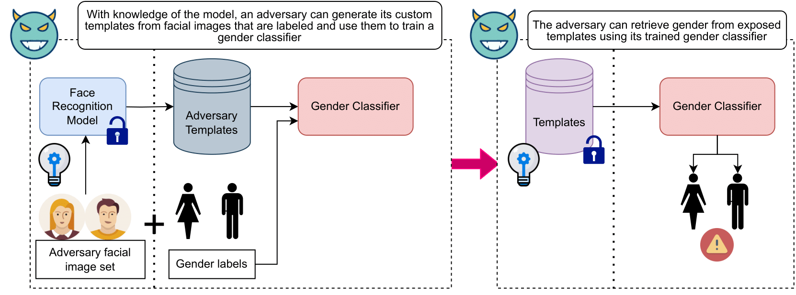
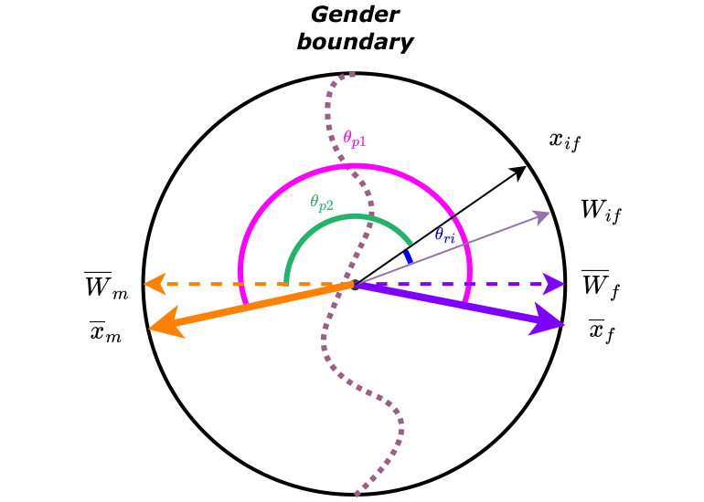

# Gender privacy angular constraints for face recognition

[](https://opensource.org/licenses/MIT)
[](https://www.python.org/downloads/)

## Description

This repository contains code to reproduce the results from our paper [**"Gender Privacy Angular Constraints for Face Recognition"**](10.1109/TBIOM.2024.3390586) published in the journal **IEEE Transactions on Biometrics, Behavior, and Identity Science** in 2024. By applying angular constraints during model finetuning, the project aims to minimize the risk of revealing individuals' gender information, thereby enhancing privacy at the template level of face recognition systems.

  

## Installation
To install the necessary dependencies for this project, use the provided `requirements.txt` file:


```bash
pip install -r requirements.txt
```
## Data and Pretrained Models
The project utilizes datasets such as LFW, AgeDB, ColorFeret, and a sample of VGGFace2 for verification and evaluation of gender privacy. You can download the binary files containing the images for evaluation as well as the pre-trained privacy-enhanced layers for each backbone [here](https://surfdrive.surf.nl/files/index.php/s/zerXUXI4U29Juyu).


## Training

Ensure that your image dataset is organized in a specific folder structure. The root folder of the dataset should contain subject folders, and within each subject folder, you should place the images belonging to that subject. The subject folders should be named `subjectid_gender`:
- `subjectid`: A unique identifier for the subject.
- `gender`: The perceived gender expression (feminine 1 or masculine 0) of the subject.
A sample directory tree could be:

```
dataset_root/
├── MariaCallas_1/
│ ├── image1.jpg
│ ├── image2.jpg
│ └── ...
├── ElvisPresley_0/
│ ├── image1.jpg
│ ├── image2.jpg
│ └── ...
└── ...
```
After specifying the training configurations in the file [./config/config.py], run this command:

```bash
python finetune.py
```
Please refer to our paper for the choice of hyperparameters.

## Evaluate
```bash
python eval/evaluation.py --log_root "path/to/log" --model_root "path/to/model/directory"  --experiment-name "experimentname" --reference_pth "path/to/reference/csv/results" 

```
```experiment-name``` should refer to the different types of training settings. For instance if you train using only one dataset e.g ColorFeret, ```experiment-name``` = ```OneDataset/ColorFeret```. The script ```evaluate.py``` will run the evaluations of all the models generated with this experiment setting.

## Contributing

If you encounter any issues, have suggestions, or want to contribute improvements, please submit a pull request.

## Acknowledgments
 This repository contains some code from [InsightFace: 2D and 3D Face Analysis Project](https://github.com/deepinsight/insightface).
  If you find this repository useful for you and use it for research purposes, please consider citing the following papers.

```bibtex
  @article{rezgui2024gender,
  title={Gender Privacy Angular Constraints for Face Recognition},
  author={Rezgui, Zohra and Strisciuglio, Nicola and Veldhuis, Raymond},
  journal={IEEE Transactions on Biometrics, Behavior, and Identity Science},
  year={2024},
  publisher={IEEE}
}
```
```bibtex
@inproceedings{boutros2022elasticface,
  title={Elasticface: Elastic margin loss for deep face recognition},
  author={Boutros, Fadi and Damer, Naser and Kirchbuchner, Florian and Kuijper, Arjan},
  booktitle={Proceedings of the IEEE/CVF conference on computer vision and pattern recognition},
  pages={1578--1587},
  year={2022}
}
```
```bibtex

@article{liu2022sphereface,
  title={Sphereface revived: Unifying hyperspherical face recognition},
  author={Liu, Weiyang and Wen, Yandong and Raj, Bhiksha and Singh, Rita and Weller, Adrian},
  journal={IEEE Transactions on Pattern Analysis and Machine Intelligence},
  volume={45},
  number={2},
  pages={2458--2474},
  year={2022},
  publisher={IEEE}
}
```

```bibtex
@inproceedings{deng2019arcface,
  title={Arcface: Additive angular margin loss for deep face recognition},
  author={Deng, Jiankang and Guo, Jia and Xue, Niannan and Zafeiriou, Stefanos},
  booktitle={Proceedings of the IEEE/CVF conference on computer vision and pattern recognition},
  pages={4690--4699},
  year={2019}
}
```

